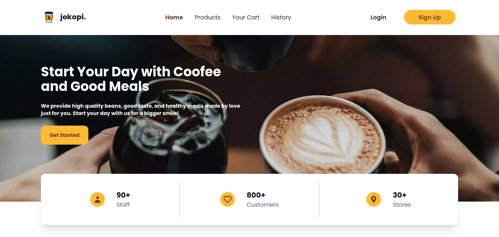
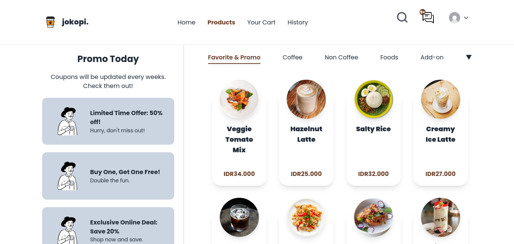
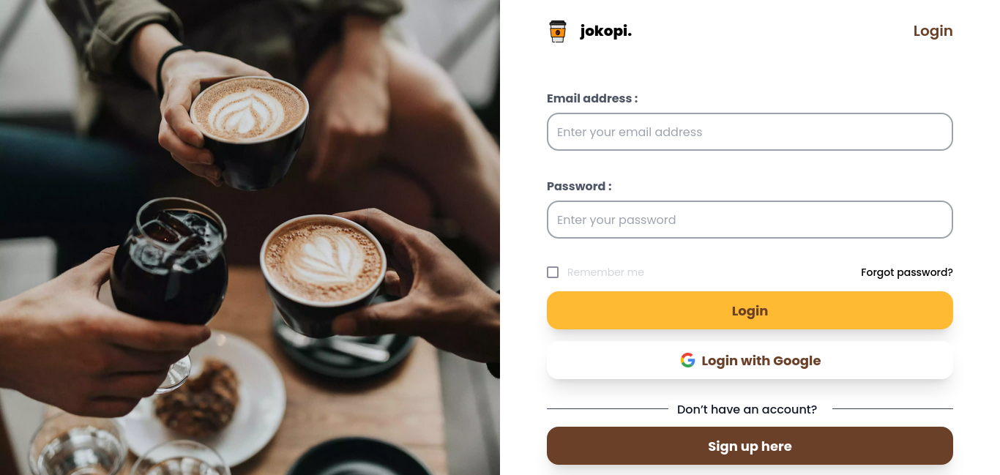
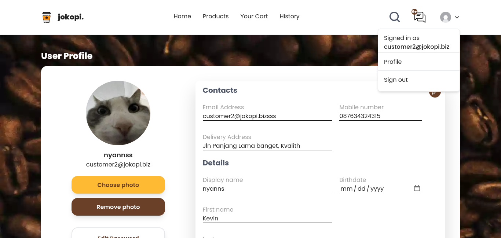
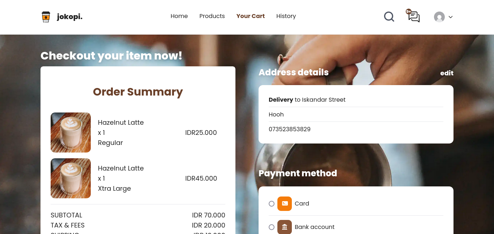

<div align="center">


[](#tech-stack)

<h3 align="center"><b>jokopi</b> - Example App</h3>
   <p align="center">
   Open Source. Front-end.
   </p>

[Demo](https://jokopi-react.vercel.app/) · [Related Projects](#related-projects) · [Request Feature](#report-bug)

</div>

## Table of Contents

- [Overview](#overview)
  - [Features](#features)
- [Tech Stack](#tech-stack)
- [Getting Started](#getting-started)
  - [Prerequisites](#prerequisites)
  - [Installation](#installation)
- [Screenshots](#screenshots)
- [Resources](#resources)
- [Related Projects](#related-projects)
- [License](#license)
- [Report Bug](#report-bug)

## Overview

jokopi is a complete open-source app coffee shop ordering.

This is an example application that shows how `jokopi` is applied to a react app.

Build using create react app.

You can build it by yourself

### Features

- Login, Register, Forgot Password, Logout
- Profile
- History Order
- Products (Search, Sort, Filter)
- Cart
- Transactions
- Admin Dashboard
- Manage Order (Admin)
- etc.

## Tech Stack

- [React](https://react.dev/) & [React Router DOM](https://reactrouter.com/en/main)
- [Redux](https://redux.js.org/) & [Redux Persist](https://www.npmjs.com/package/redux-persist) (Local Storage)
- [TailwindCSS](https://tailwindcss.com/) & [DaisyUI](https://daisyui.com/)
- [React Hot Toast](https://www.npmjs.com/package/react-hot-toast)
- [Vercel](https://vercel.com/dashboard) for deploying demo
- etc.

## Getting Started

### Prerequisites

You need to install some software to run this project

- [Node.js](https://nodejs.org/en/download) (LTS version recommended, 14 or newer)

### Installation

1. Clone this repository to your local

   ```bash
   git clone https://github.com/nyannss/jokopi-react.git
   ```

2. Change current directory

   ```bash
   cd jokopi-react
   ```

3. Install dependencies

   If you using npm

   ```bash
   npm install
   ```

   If you using yarn

   ```bash
   yarn
   ```

4. Setup environment

   ```env
   REACT_APP_BACKEND_HOST = (your rest api host)
   REACT_APP_WEBSITE_NAME = (your project name)
   ```

5. Running app

   ```bash
   npm start
   ```

## Screenshots

<div style="display:flex;flex-wrap:wrap;gap:0.5rem">
 




</div>

## Resources

Special thanks for providing resources such as icons and images.

- [Flaticon](https://flaticon.com/)
- [unDraw](https://undraw.co/)
- [SVGRepo](https://svgrepo.com/)
- and other sources.

If there are resources that belong to you, please let me know, I will write it here.

## Related Projects

- [jokopi-express](https://github.com/nyannss/jokopi) - Rest API
- [jokopi-react-native](https://github.com/nyannss/jokopi-react-native) - Android & iOS Application

## License

This project is licensed under the ISC License. See the [LICENSE](LICENSE) file for details.

## Report Bug

Any error report you can pull request
or contact: <nyannss@proton.me>
